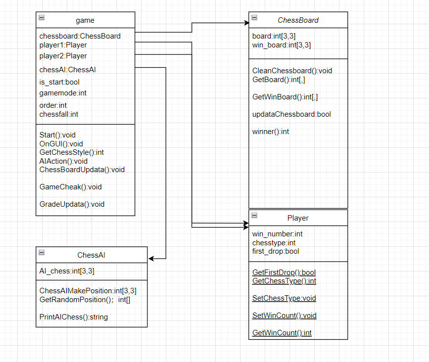
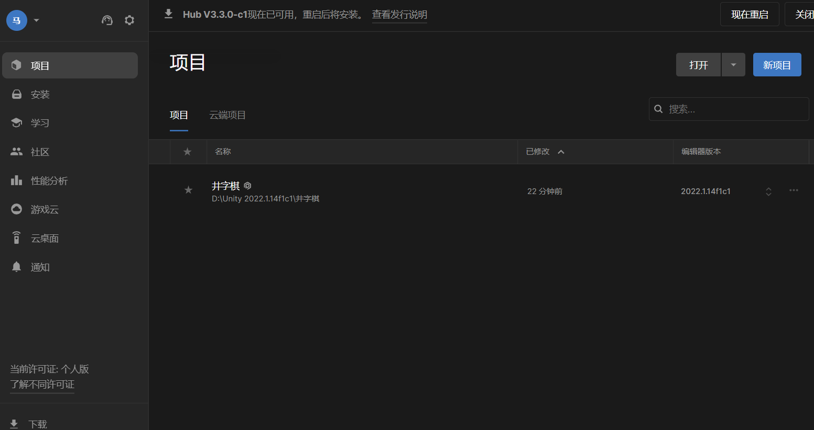
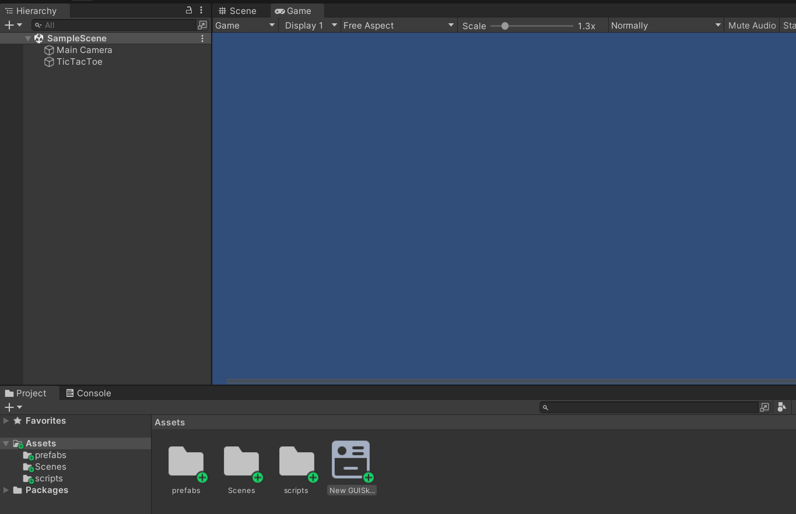
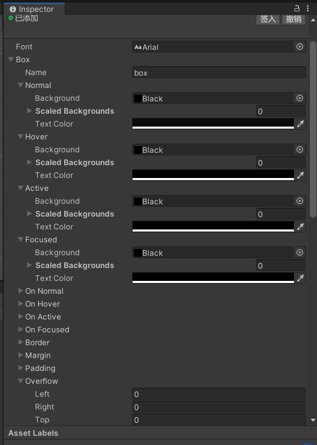
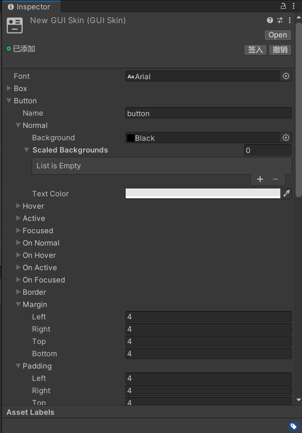
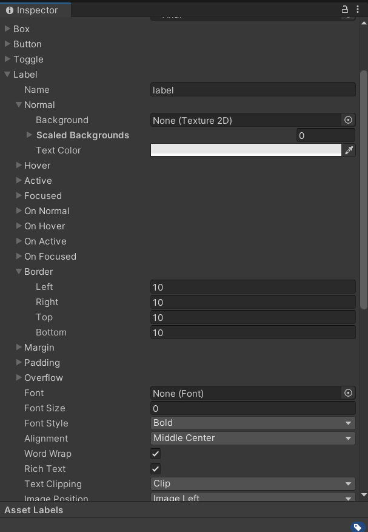
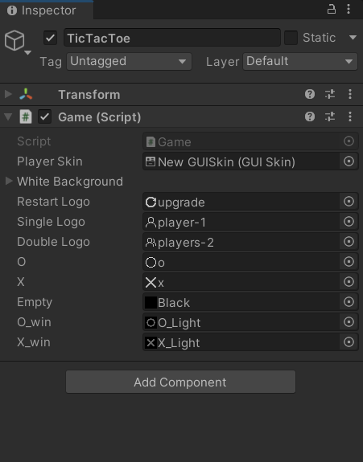
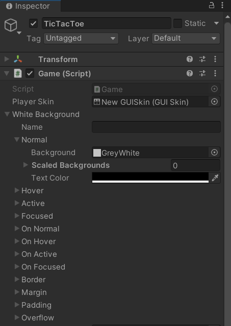
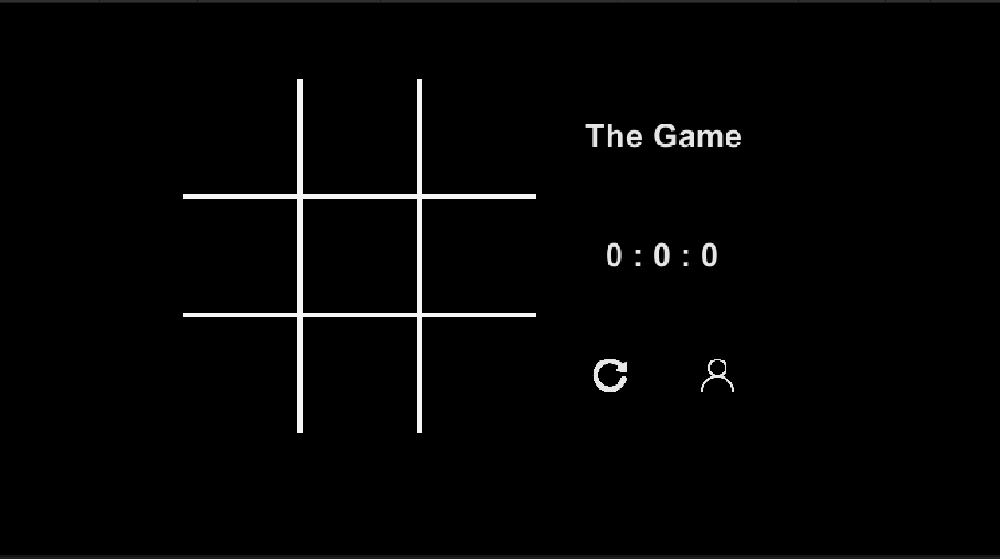
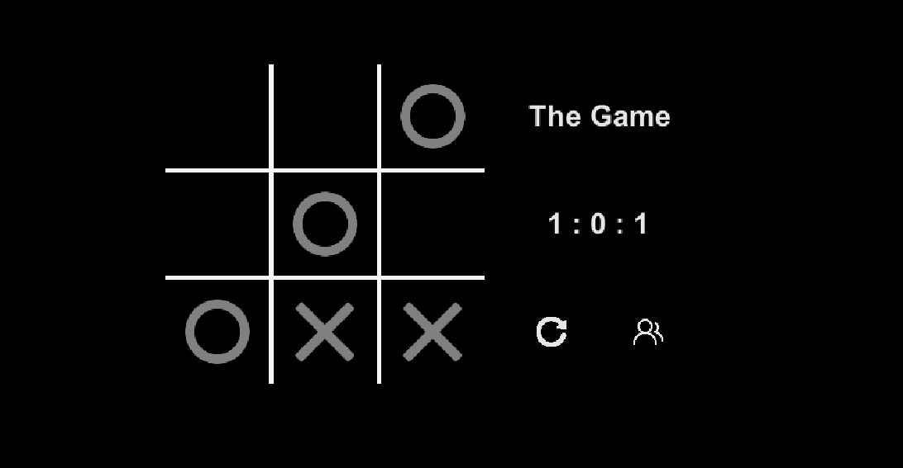

# unity3D项目――井字棋
## 马宛宜 20337092 软件工程
### 项目说明
在unity3D上创建一个2D游戏――井字棋，支持单人模式与双人模式，本次实验的总体设计参考<https://playtictactoe.org/>  
实验图像来源：<https://www.iconfont.cn/>  
## 实验类图
 
注：也可直接打开文件夹中类图直接查看

## 项目建立步骤
### 在unity3D中创建一个文件夹，名字为“井字棋”
  

### 新建一个名为“TicTacToe”的项目，在Assets中创建文件夹“perfabs”,"Scences","scripts"和GUISkin
 

### 将写好的代码文件拖进“scripts”中，将准备好的图片拖进"perfabs"中

### 设置GUISkin的参数,分别是Box，Label和Button




### 点击“TicTacToe”，将文件“Game”拖到右边框中，分别将组件进行配置



### 配置结束后点击运行，运行游戏，游戏设置结束

## 代码重点内容（这里只分析GUI的结构，其他的可以详细看代码注释）
``` clojure
    void OnGUI()
    {
        GUI.skin = playerSkin;
        // set full screen is a box, name is empty
        GUI.Box(new Rect(0, 0, Screen.width, Screen.height), "");
        GUI.BeginGroup(new Rect(Screen.width * 0.5f - 300, Screen.height * 0.5f - 200, gamewidth, gameheight));
            // set chessboard
            GUI.Box(new Rect(edge + 2, edge + 2, 3 * chesssize - 4, 3 * chesssize - 4), "", whiteBackground); // 棋盘
            // AI drop chess
            AIAction();
            // 显示棋子与玩家下棋
            ChessBoardUpdata();
            // 判断胜负
            GameCheak();
            GUI.Label(new Rect(2 * edge + 3 * chesssize, edge, 150, 100), "The Game");
            // 更新比分表
            GradeUpdata();
            GUI.BeginGroup(new Rect(2 * edge + 3 * chesssize, edge + 200, 150, 100));
                //设置重新开启一局
                SetResentButton();
                // 更改游戏模式
                SetGameModeButton();
            GUI.EndGroup();
        GUI.EndGroup();
    }
```
### OnGUI逻辑说明
#### OnGUI()函数在每一帧都会调用，用于刷新游戏界面
#### 主要流程为设置棋盘，AI走棋，棋盘更新与玩家走棋，判断胜负，更新比分表，和重新开始一句和更改游戏模式的按钮
AIAction()：AI走棋  
ChessBoardUpdata()：更新棋盘，玩家点击下棋  
GameCheak()：判断当前局面是否结束  
GradeUpdata()：更新比分表  
SetResentButton()：设置重新开启一句的按钮  
SetGameModeButton()：更改游戏模式（双人与单人）

### 项目结果说明
游戏开始界面

游戏进行结果展示

游戏项目展示：
请看 image/项目演示  

### 参考资料
unity 手册：<https://docs.unity.cn/cn/current/Manual/index.html>
还有部分SCDN博客

### 实验心得
1.本次实验我完成的时间较长，主要是我想与面向对象设计的知识点结合起来，将文件分割开来，也因此出现了很多错误，debug的时间较长  
2.我在书写代码时存在很多细节上的错误，甚至还出现了忘记更新盘面的错误，这在我之后的代码书写中需要谨慎的注意  
3.另外，我在完成时出现了一些不知名bug，一开始查找了很多解决方案，但是觉得自己代码本身是没有错误的，因此重启了一下项目，发现bug消失了，因此在之后完成的时候有时可以重启尝试一下，不要过于执着。  

