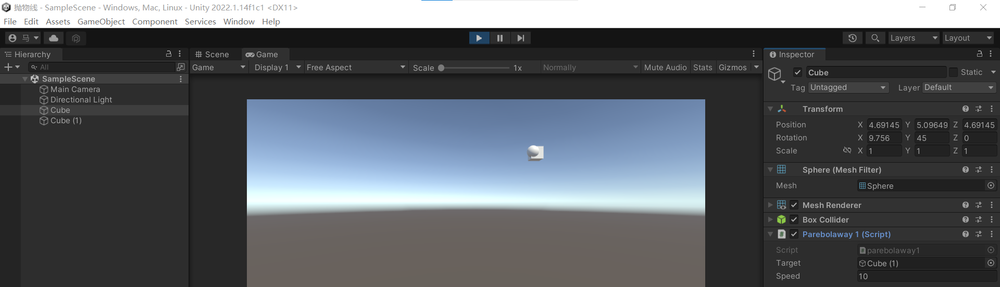
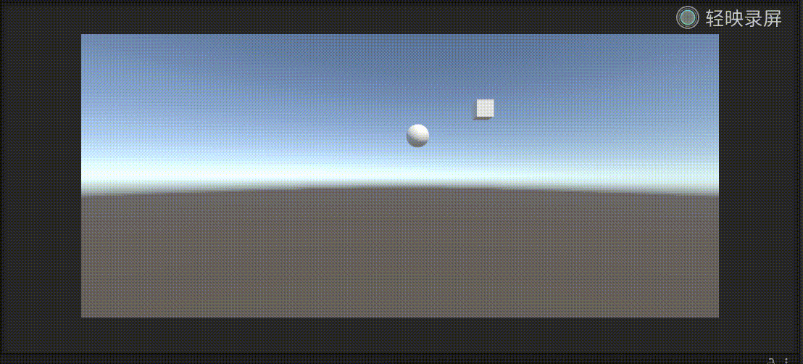
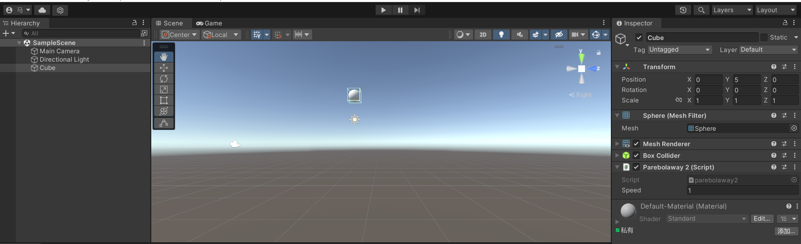
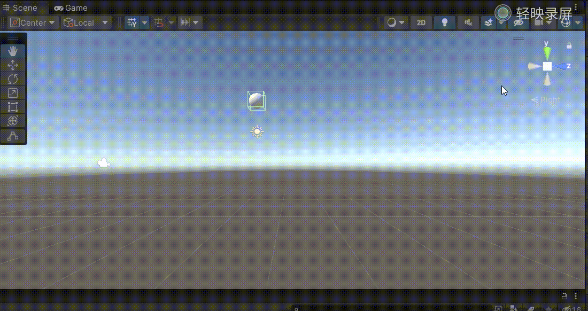
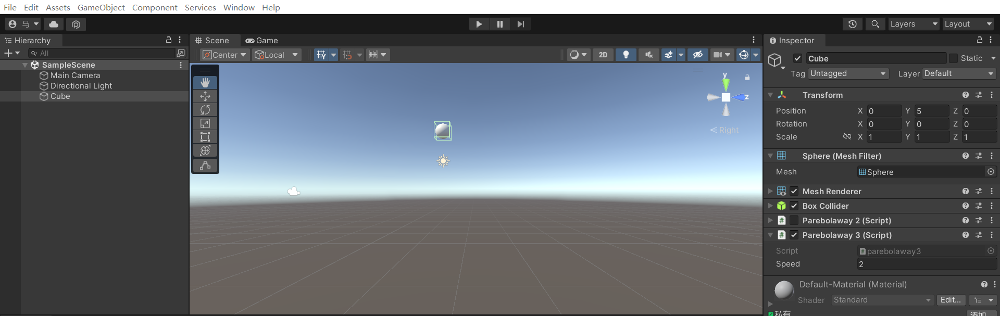
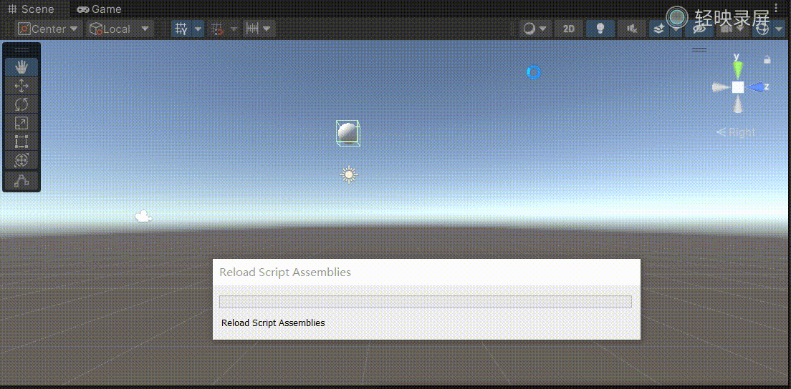

# 作业3――抛物线的三种实现
## 马宛宜 20337092 软件工程
### 作业要求
请用三种方法，实现物体的抛物体运动
### 具体实现
### 方法1
我主要使用Transform的LookAt()函数和transform.rotation、Quaternion.Euler来实现一个物体抛物线击打目标。

#### 项目创建过程
创建一个空项目，命名为“抛物线”，在Assest中创建一个文件夹scripts，将代码放入scripts中。  
创建一个两个对象，分别表示击中的球，和被击中的目标方块，将方法1的代码拖到球上，设置target为方块  
注意这里要将两个物体的坐标设置为不一样，才可看见抛物线。


#### 结果展示


代码：
```csript
using UnityEngine;
using System.Collections;

public class parebolaway1 : MonoBehaviour
{
	// 击中目标
	public GameObject target;
	// 设定速度
	public float speed = 10;
	// 距离
	private float distanceToTarget;
	private bool move = true;

	void Start()
	{
		distanceToTarget = Vector3.Distance(this.transform.position, target.transform.position);
		StartCoroutine(Shoot());
	}

	IEnumerator Shoot()
	{
		while (move)
		{
			Vector3 targetPosition = target.transform.position;
			// 使瞄准方的物体瞄准target，即使物体的z轴正对target所对的位置
			this.transform.LookAt(targetPosition);
			// 角度
			float angle = Mathf.Min(1, Vector3.Distance(this.transform.position, targetPosition) / distanceToTarget) * 45;
			// 使用四元进行旋转
			this.transform.rotation = this.transform.rotation * Quaternion.Euler(Mathf.Clamp(-angle, -42, 42), 0, 0);
			float currentDist = Vector3.Distance(this.transform.position, target.transform.position);
			print("currentDist" + currentDist);
			// 当物体与target足够小的时候停止移动
			if (currentDist < 0.5f)
				move = false;
			// 物体移动，第一个参数为速度，为矢量，即（0，0，1）乘距离
			// 注意这里当剩余距离小于speed*单位长度时，只能移动剩余距离，因此要有一个最小值的取值
			this.transform.Translate(Vector3.forward * Mathf.Min(speed * Time.deltaTime, currentDist));
			yield return null;
		}
	}
}
```
由于主要代码已经注释清楚，这里只是简述一下思路，首先设定一个target目标，表示被击打的对象。直到集中目标（即与目标之间的距离足够小）的时候不断进行前进。使用LookAt()函数和transform.rotation、Quaternion.Euler来实现运动物体的旋转，来确保物体向着target移动。
 ### 方法2
 方法2我使用的是transform.position的加减，每一次都向右移动一帧单位，向下移动一段距离

 #### 项目创建过程
 前期设置一致，只是这里只需要1个球即可，设置速度为1
 

#### 结果展示


#### 代码
```csripts
using System.Collections;
using System.Collections.Generic;
using UnityEngine;

public class parebolaway2 : MonoBehaviour
{
    public float speed = 1;
    // Start is called before the first frame update
    void Start()
    {

    }

    // Update is called once per frame
    void Update()
    {
        this.transform.position += Vector3.right * Time.deltaTime * 5;
        this.transform.position += Vector3.down * Time.deltaTime * (speed / 10);
        speed++;
    }
}
```

 ### 方法3
 方法3我使用创建一个Vector3，通过创建的三个变量设置x，y的移动，z不移动，然后使用transform.Translate让物体移动

 #### 项目创建过程
 前期设置一致，只是这里只需要1个球即可，设置速度为2（与方法2区分一下）
 

#### 结果展示


#### 代码
```csripts
using System.Collections;
using System.Collections.Generic;
using UnityEngine;

public class parebolaway3 : MonoBehaviour
{
    public float speed = 1;
    // Start is called before the first frame update
    void Start()
    {

    }

    // Update is called once per frame
    void Update()
    {
        Vector3 v = new Vector3(Time.deltaTime * 5, -Time.deltaTime * (speed / 10), 0);
        this.transform.Translate(v);
        speed++;
    }
}
```

### 实验感想
本次实验其实较为简单，但是我一开始实现的时候想的过于复杂了，因此一开始的实现很困难，后来参考了网络的一些实现方法才比较简便的实现了。本实验的关键点是transform和vector3的运用。