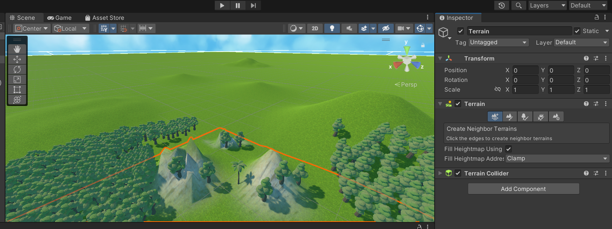

## 作业4 场景搭建
### 马宛宜 20337092 软件工程
#### 作业说明
下载Fantaasy Skybox FREE，构建自己的游戏场景，并未场景设计地形（含树木和草地等元素）

#### 构建过程
1.在unity的asset store上下载Fantasy Skybox FREE，以及下载一些树的图片，以便后续搭建  

2.点击window->asset store->点击Package manager->my assets，将导入的资源包下载下来  

3.在assets中创建一个material，将自己需要的skybox背景图片设置好

4.新建一个Terrain，在GameObject->3D Object->Terrain创建

5.点击新建的terrain，在terrain上有5个功能，首先点击第一个来创建一个neighbor terrain（这里选定的是红色的部分）

6.第二个为print terrain，可以绘制地形

7.想要有草地的效果，就还是在print terrain的模式下，点击下面的切换到print Texture，在Fantasy Skybox FREE中找到想要的地表资源加入到trarain layers中，可以进行绘制

8.点击第三个print tree，将树的资源加入到trees中，点击Edit Trees..来添加树木，对于不同的树使用画笔来进行绘制

9.绘制完成

10.在主相机中增加一个Skybox的部件，并且将第3步设置好的matrices载入到skybox中，场景搭建完成

#### 结果展示

#### 部分资源
[assets store](https://assetstore.unity.com/)