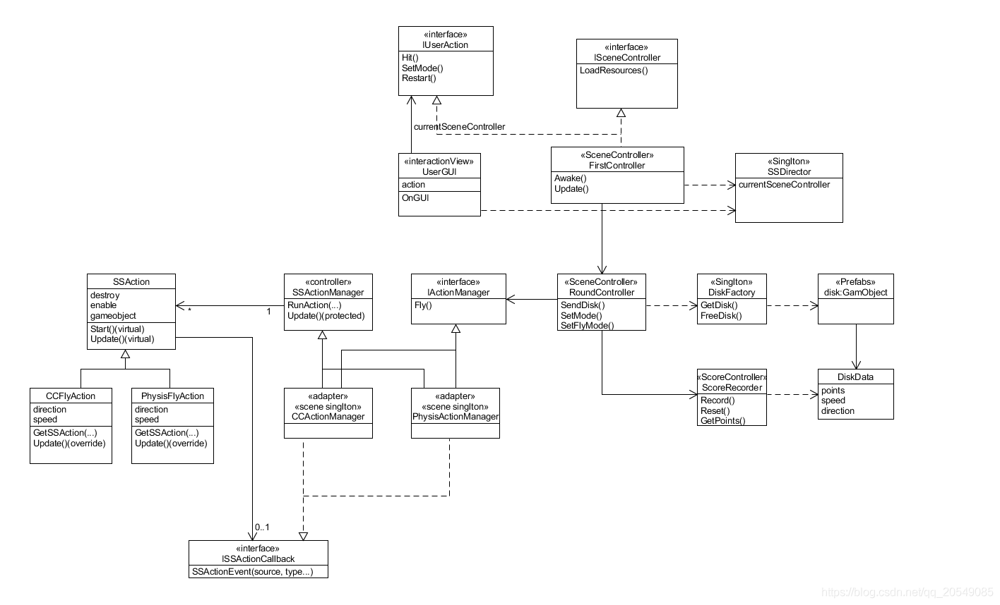
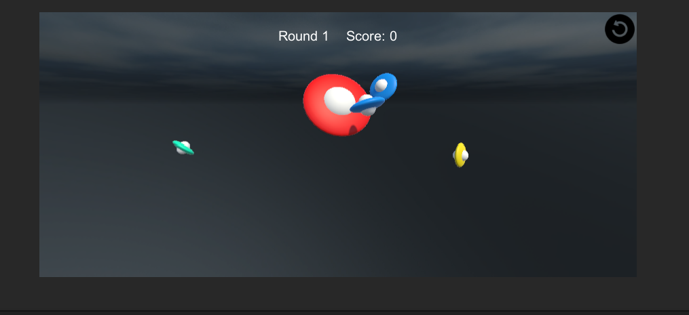
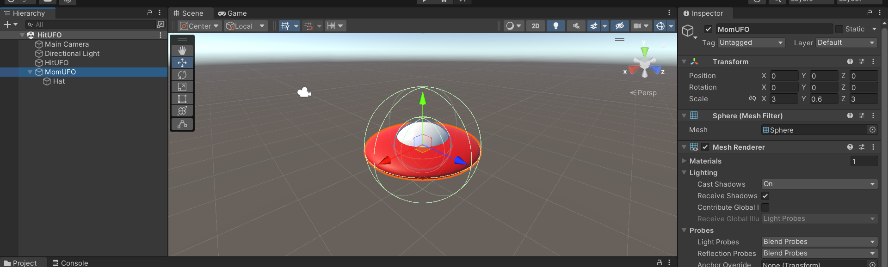
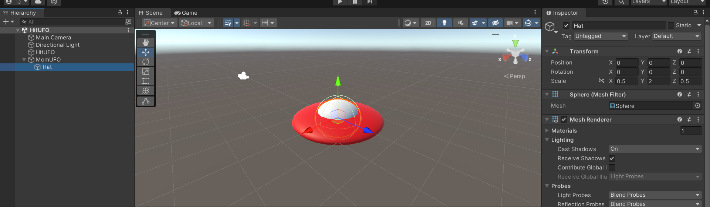
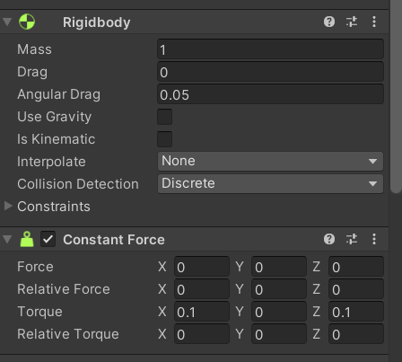
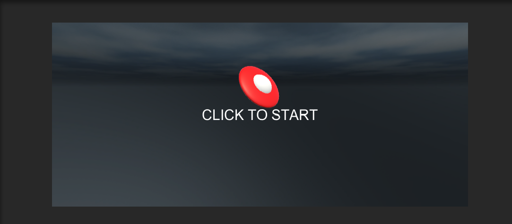
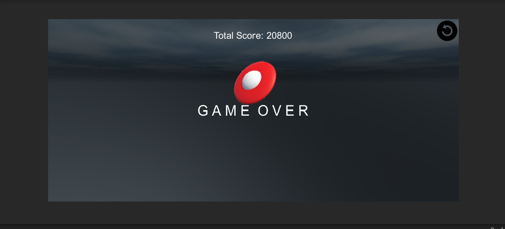

# 第5次作业——鼠标打飞碟游戏

## 马宛宜 20337092 软件工程

### 作业说明

> 在这里我直接将课件5和6的打飞碟游戏集合在一起实现

**1、编写一个简单的鼠标打飞碟游戏【选做】**

- 游戏内容要求：
  1. 游戏有 n多个轮次，每个轮次都包括10 个轨迹；
  2. 每个轨迹的飞碟的色彩、大小、发射位置、速度、角度、同时出现的个数都可能不同。它们由该轮次的 ruler 控制；
  3. 每个轨迹的飞碟有随机性，总体难度随 round 上升；
  4. 鼠标点中得分，得分规则按色彩、大小、速度不同计算，规则可自由设定。
- 游戏的要求：
  - 使用带缓存的工厂模式管理不同飞碟的生产与回收，该工厂必须是场景单实例的！具体实现见参考资源 Singleton 模板类
  - 近可能使用前面 MVC 结构实现人机交互与游戏模型分离

**2、编写一个简单的自定义Component**【详情请看说明游戏实现—飞碟数据部分】

- 用自定义组件定义几种飞碟，做成预制
- 完成自定义组件，编辑并赋予飞碟一些属性

**3、改进打飞碟游戏【选做】**

- 按adapter模式设计图修改飞碟游戏
- 使它同时支持物理运动和运动学（变换）运动。


### 游戏运行

直接将代码的Assets中的内容放入到新建的项目的Assets中，然后进入 Scenes 文件夹中双击 HitUFO 场景运行即可。


### 设计架构

> [参考博客](https://blog.csdn.net/qq_20549085/article/details/102540163)

总体设计参考下面的架构



#### 代码结构

> * /Assets
>   * /Resources
>     * /Icon 			// 游戏图标
>     * /Material     // 颜色材料
>     * /Prefabs      // 五种不同颜色的飞碟预制
>     * /SkyBox       // 天空盒
>   * /Scenes // 游戏场景
>   * /Scripts
>     * /Controller
>       * /Action // **动作模块**
>         * CCActionManager.cs	// 飞行动作管理者，负责生成飞行动作，并接受飞行动作的回调信息，使飞碟被回收。
>         * CCFlyAction.cs               // 飞行动作，将飞行拆分成水平和垂直两个方向的运动，水平速度恒定，垂直方向施加重力加速度
>         * *IActionManager.cs*            // 动作管理器接口
>         * *ISSActionCallback.cs*         // 回调接口
>         * PhysisActionManager.cs  // 物理运动管理器
>         * PhysisFlyAction.cs             // 物理运动实现
>         * SSAction.cs                         // 抽象动作
>         * SSActionManager.cs         // 动作管理器模板
>       * /Round // **回合模块**
>         * RoundController.cs        
>       * /Score   // **计分模块**
>         * ScoreRecorder.cs 
>       * FirstController.cs                      // 场景控制器，负责游戏主要逻辑
>       * *ISceneController.cs*                     // 场景控制类接口
>       * Singleton.cs                               // 单实例类
>       * SSDirector.cs                             // 导演类
>     * /Model
>       * /Disk  //**飞碟模型** 
>         * DiskData.cs                        // 飞碟基本数据
>         * DiskFactory.cs                   // 工厂模式产生飞碟
>     * /View        //**交互模型**
>       * *IUserAction.cs*                           // 用户动作接口，提供点击、重置、选择模式三个函数的接口。
>       * UserGUI.cs                               // 界面类，构建UI并捕捉用户动作。

#### 游戏说明

这是一个打飞碟小游戏（鼠标打），不同的小飞碟会从大飞碟中飞出，我们点击小飞碟即可将其轰炸。不同等级的小飞碟的分数不同（黑色飞碟高达5000分），每点击到不同的飞碟分数值就不一样，五回合下来，累计最终得分。



* 一局游戏有5个Round，每个回合的难度不同，每个回合有10trial，每一个trial会发射出若干个飞碟，飞碟按照不同的方向和速度从红色的母飞碟中飞出。

* 一共有五种飞碟，它们通过颜色区分，不同的飞碟的分数、速度范围和方向范围都不一样

- 飞碟种类：

    | 飞碟等级     | 1        | 2       | 3       | 4       | 5      |
    | ------------ | -------- | ------- | ------- | ------- | ------ |
    | 颜色         | 黄色     | 绿色    | 青色    | 蓝色    | 黑色   |
    | 重量（千克） | 0.6-1.4  | 1.2-2.8 | 1.4-4.6 | 1.6-6.4 | 1-9    |
    | 分值         | 50       | 100     | 500     | 1000    | 5000   |
    | 速度方向     | -0.1~0.1 | -2~2    | -5~5    | -10~10  | -20~20 |
    | 力的方向     | -1~1     | -2~2    | -5~5    | -10~10  | -20~20 |


### 游戏实现

#### 飞碟制作

飞碟的组件由一个压扁的小球和一个小球构成，其中Hat是MomUFO的子类，会随着外设变化而变化





之后为这个飞碟增加Rigidbody和Constant Force组件，增加Mass（重量）和力矩（Torque），以让飞碟可以转动。



最终将制作好的飞碟拖进Assets/Resources/Perfabs中（需要变换颜色）

#### 单实例类

场景单实例类，当所需的实例第一次被需要时，在场景内搜索该实例，下一次使用时不需要搜索直接返回。在获取单例模式对象时，只需`Singleton<ClassName>.Instance`，例如获取单例飞碟工厂对象：

  ``` c#
  diskFactory = Singleton<DiskFactory>.Instance;
  ```
Singleton.cs

```c#
using System.Collections;
using System.Collections.Generic;
using UnityEngine;

public class Singleton<T> : MonoBehaviour where T : MonoBehaviour
{
	protected static T instance;

	public static T Instance {  
		get {  
			if (instance == null) { 
				instance = (T)FindObjectOfType (typeof(T));  
				if (instance == null) {  
					Debug.LogError ("An instance of " + typeof(T) + " is needed in the scene, but there is none.");  
				}  
			}  
			return instance;  
		}  
	}
}
```

#### 工厂模式

这种类型的设计模式属于创建型模式，它提供了一种创建对象的最佳方式。在工厂模式中，我们在创建对象时不会对客户端暴露创建逻辑，并且是通过使用一个共同的接口来指向新创建的对象。

例如在本游戏中，就创建了一个管理Disk的工厂`DiskFactory`，它负责对disk进行创建，设置和释放。在控制器，工厂隐藏了具体的细节，只是提供了相应的函数。

在实现时，我使用了两个队列来管理飞碟，一个已经使用的飞碟队列，一个空闲的飞碟队列。当其他组件需要飞碟时，工厂会首先寻找相应满足条件的空闲飞碟，如果没有，则会创建相应的飞碟。当本轮飞碟被使用之后，工厂会将相应的飞碟由busy队列移到空闲队列。由此实现对飞碟的管理

```c#
using System.Collections;
using System.Collections.Generic;
using UnityEngine;

public class DiskFactory : MonoBehaviour
{
    private List<DiskData> busyDisks; // 正在使用的飞碟
    private List<DiskData> freeDisks; // 空闲的飞碟

    string[] Prefabs = new string[5] {"Prefabs/YellowDisk", 
        "Prefabs/GreenDisk", "Prefabs/CyanDisk", 
        "Prefabs/BlueDisk", "Prefabs/BlackDisk"};

    // Start is called before the first frame update
    void Start()
    {
        busyDisks = new List<DiskData>();
        freeDisks = new List<DiskData>();
    }

    // 生产飞碟,特定level的
    public GameObject GetDisk(int level){
        GameObject disk = null;

        bool find = false;
        // 如果可以在空闲飞碟列表中找到需要level的，则直接使用
        for(int i = 0; i < freeDisks.Count; i++){
            if(freeDisks[i].level == level){
                disk = freeDisks[i].gameObject;
                freeDisks.RemoveAt(i);
                find = true;
                break;
            }
        }
        
        if(find == false){
            disk = GameObject.Instantiate<GameObject>(Resources.Load<GameObject>(Prefabs[level - 1]), Vector3.zero, Quaternion.identity);
            disk.AddComponent<DiskData>();
            disk.AddComponent<Rigidbody>();
            disk.AddComponent<ConstantForce>();
        }

        if(disk != null){
            DiskData diskData = disk.GetComponent<DiskData>();
            setDiskData(diskData, level);
            busyDisks.Add(diskData);
        }

        return disk;
    }

    // 释放飞碟
    public void FreeDisk(GameObject disk){
        foreach(DiskData diskData in busyDisks){
            if(diskData.gameObject.GetInstanceID() == disk.GetInstanceID()){
                disk.SetActive(false);
                busyDisks.Remove(diskData);
                freeDisks.Add(diskData);
                break;
            }
        }
    }

    public void setDiskData(DiskData diskData, int level){
        if(level <= 1){
            diskData.level = 1;
            diskData.mass = 1.0F + Random.Range(-1F, 1F) * 0.4F;
            diskData.score = 50;
            diskData.speed = new Vector3(Random.Range(-0.1F, 0.1F), Random.Range(-0.1F, 0.1F), Random.Range(-0.1F, 0.1F));
            diskData.force = new Vector3(Random.Range(-1F, 1F), Random.Range(-1F, 1F), Random.Range(-1F, 1F));
        }
        else if(level == 2){
            diskData.level = 2;
            diskData.mass = 2.0F + Random.Range(-1F, 1F) * 0.8F;
            diskData.score = 100;
            diskData.speed = new Vector3(Random.Range(-2F, 2F), Random.Range(-2F, 2F), Random.Range(-2F, 2F));
            diskData.force = new Vector3(Random.Range(-2F, 2F), Random.Range(-2F, 2F), Random.Range(-2F, 2F));
        }
        else if(level == 3){
            diskData.level = 3;
            diskData.mass = 3.0F + Random.Range(-1F, 1F) * 1.6F;
            diskData.score = 500;
            diskData.speed = new Vector3(Random.Range(-5F, 5F), Random.Range(-5F, 5F), Random.Range(-5F, 5F));
            diskData.force = new Vector3(Random.Range(-5F, 5F), Random.Range(-5F, 5F), Random.Range(-5F, 5F));

        }
        else if(level == 4){
            diskData.level = 4;
            diskData.mass = 4.0F + Random.Range(-1F, 1F) * 2.4F;
            diskData.score = 1000;
            diskData.speed = new Vector3(Random.Range(-10F, 10F), Random.Range(-10F, 10F), Random.Range(-10F, 10F));
            diskData.force = new Vector3(Random.Range(-10F, 10F), Random.Range(-10F, 10F), Random.Range(-10F, 10F));

        } 
        else if(level >= 5){
            diskData.level = 5;
            diskData.mass = 5.0F + Random.Range(-1F, 1F) * 4.0F;
            diskData.score = 5000;
            diskData.speed = new Vector3(Random.Range(-20F, 20F), Random.Range(-20F, 20F), Random.Range(-20F, 20F));
            diskData.force = new Vector3(Random.Range(-20F, 20F), Random.Range(-20F, 20F), Random.Range(-20F, 20F));
        }
    }

    void Update()
    {
        
    }
}
```

#### 飞碟数据

这里对应的就是要求的第二条，我为每一个Disk创建了一个类来增加了Disk的参数,实现了自定义组件

```c#
using System;
using UnityEngine;

[System.Serializable]
public class DiskData : MonoBehaviour
{
    [Tooltip("飞碟级别")]
    public int level; 
    [Tooltip("飞碟质量")]
    public float mass;
    [Tooltip("飞碟颜色")]
    public Color color;
    [Tooltip("击中分数")]
    public int score;
    [Tooltip("初始速度")]
    public Vector3 speed;
    [Tooltip("恒定外力")]
    public Vector3 force;    
}

[CreateAssetMenu(fileName = "DiskItem", menuName = "(ScriptableObject)DiskItem")]
public class DiskItem : ScriptableObject
{
    public string Name;
    [Tooltip("飞碟属性")]
    public DiskData diskData;
}
```

#### 回合控制器RoundController

设立五个属性，分别表示回合、飞碟数、轮次、时间和是否开始的bool值

```c#
public IActionManager actionManager;
public DiskFactory diskFactory;
public ScoreRecorder scoreRecorder;
public UserGUI userGUI;

int round;
int diskNum;
int trial;
float time;

bool start;
```

`start()`：游戏开始，首先调用单例模式获取对象，再将五个参数设定为默认开始值

```c#
void Start() {
    // 通过单例模式获取对象
    actionManager = Singleton<CCActionManager>.Instance;
    diskFactory = Singleton<DiskFactory>.Instance;
    userGUI = Singleton<UserGUI>.Instance;
    scoreRecorder = Singleton<ScoreRecorder>.Instance;
    // 初始设置
    time = 0.0F;
    round = 1;
    trial = 0;
    diskNum = 5;
    start = false;
    SetMode(true);
    scoreRecorder.Reset();
}
```

`updata()`：更新轮数和轮次，每一round的数值会进行变化。每10个trial为1个round，随着round的增加，每一个trial间隔时间就越短

```c#
void Update() {
    if(start) {
        time += Time.deltaTime;

        if(round > 5){
            start = false;
            return;
        }

        if(trial == 10){
            // NEXT ROUND
            trial = 0;
            round++;
            diskNum += round;
        }

        if(time >= 2.0F - round * 0.2F){
            // NEXT TRIAL
            time = 0.0F;
            for(int i = 0; i < diskNum; i++){
                GenerateDisk(Random.Range(1,6));
            }            
            trial++;
        }
    }
}
```

#### 不同等级飞碟的设计

由于我将不同颜色的飞碟设定了不同的速度，分数等参数，所有我将飞碟按照点击的难易程度分了5个level，对应每一个level的飞碟的参数是不一致的，因此需要分类讨论设定

```c#
if(level <= 1){
        diskData.level = 1;
        diskData.mass = 1.0F + Random.Range(-1F, 1F) * 0.4F;
        diskData.score = 50;
        diskData.speed = new Vector3(Random.Range(-0.1F, 0.1F), Random.Range(-0.1F, 0.1F), Random.Range(-0.1F, 0.1F));
        diskData.force = new Vector3(Random.Range(-1F, 1F), Random.Range(-1F, 1F), Random.Range(-1F, 1F));
    }
    else if(level == 2){
        diskData.level = 2;
        diskData.mass = 2.0F + Random.Range(-1F, 1F) * 0.8F;
        diskData.score = 100;
        diskData.speed = new Vector3(Random.Range(-2F, 2F), Random.Range(-2F, 2F), Random.Range(-2F, 2F));
        diskData.force = new Vector3(Random.Range(-2F, 2F), Random.Range(-2F, 2F), Random.Range(-2F, 2F));
    }
    else if(level == 3){
        diskData.level = 3;
        diskData.mass = 3.0F + Random.Range(-1F, 1F) * 1.6F;
        diskData.score = 500;
        diskData.speed = new Vector3(Random.Range(-5F, 5F), Random.Range(-5F, 5F), Random.Range(-5F, 5F));
        diskData.force = new Vector3(Random.Range(-5F, 5F), Random.Range(-5F, 5F), Random.Range(-5F, 5F));

    }
    else if(level == 4){
        diskData.level = 4;
        diskData.mass = 4.0F + Random.Range(-1F, 1F) * 2.4F;
        diskData.score = 1000;
        diskData.speed = new Vector3(Random.Range(-10F, 10F), Random.Range(-10F, 10F), Random.Range(-10F, 10F));
        diskData.force = new Vector3(Random.Range(-10F, 10F), Random.Range(-10F, 10F), Random.Range(-10F, 10F));

    } 
    else if(level >= 5){
        diskData.level = 5;
        diskData.mass = 5.0F + Random.Range(-1F, 1F) * 4.0F;
        diskData.score = 5000;
        diskData.speed = new Vector3(Random.Range(-20F, 20F), Random.Range(-20F, 20F), Random.Range(-20F, 20F));
        diskData.force = new Vector3(Random.Range(-20F, 20F), Random.Range(-20F, 20F), Random.Range(-20F, 20F));
    }
```


#### 游戏对象回收

在前面的工厂模式讲过一部分，在`GetDisk()`函数中，由于我设定的对应不同颜色的飞碟对应的等级不同（速度，重量等都不同），所以在获取飞碟时需要根据不同的等级进行获取。

```c#
// @file: Assets/Model/Disk/DiskFactory.cs
GameObject disk = null;

// 在空闲队列中寻找级别相同的对象,如果有则直接使用
bool find = false;
for(int i = 0; i < freeDisks.Count; i++){
    if(freeDisks[i].level == level){
        disk = freeDisks[i].gameObject;
        freeDisks.RemoveAt(i);
        find = true;
        break;
    }
}

//如果找不到级别相同的飞碟对象，需要调用 Instantiate 新建一个
if(find == false){
    disk = GameObject.Instantiate<GameObject>(Resources.Load<GameObject>(Prefabs[level - 1]), Vector3.zero, Quaternion.identity);
    disk.AddComponent<DiskData>();
    disk.AddComponent<Rigidbody>();
    disk.AddComponent<ConstantForce>();
}

//最后更新飞碟的速度、力的数据，让飞碟轨迹每次不同
if(disk != null){
    DiskData diskData = disk.GetComponent<DiskData>();
    setDiskData(diskData, level);
    busyDisks.Add(diskData);
}

return disk;
```

### 结果展示

- 游戏开始界面



- 游戏结束界面



- 游戏过程部分展示


- 完整过程展示

  请看Image/完整过程展示.mp4