# 作业6——智能巡逻兵

## 马宛宜 20337092 软件工程

[toc]

### 作业要求

游戏设计要求：

- 创建一个地图和若干巡逻兵（使用动画）
- 每个巡逻兵走一个3~5个边的凸多边形，位置数据时相对地址即每次确定下一个目标位置，用自己当前位置为原点计算。
- 巡逻兵碰撞到障碍物，则会自动选下一个点为目标
- 巡逻兵在设定范围内感知到玩家，会自动追击玩家。
- 失去玩家目标后，继续巡逻
- 计分：玩家每次甩掉一个巡逻兵计一分，与巡逻兵碰撞游戏结束。

程序设计要求：

- 必须使用订阅与发布模式传消息
- 工厂模式生产巡逻兵


### 实现准备

**资源下载**

在Asset Store中下载以下资源：

- 3D Beginner：Tutorial Resources

  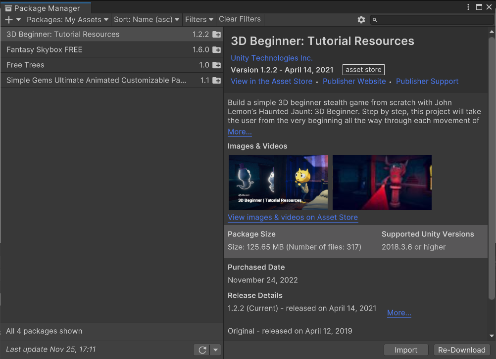

- Simple Gems Ultimate Animated Customizable

  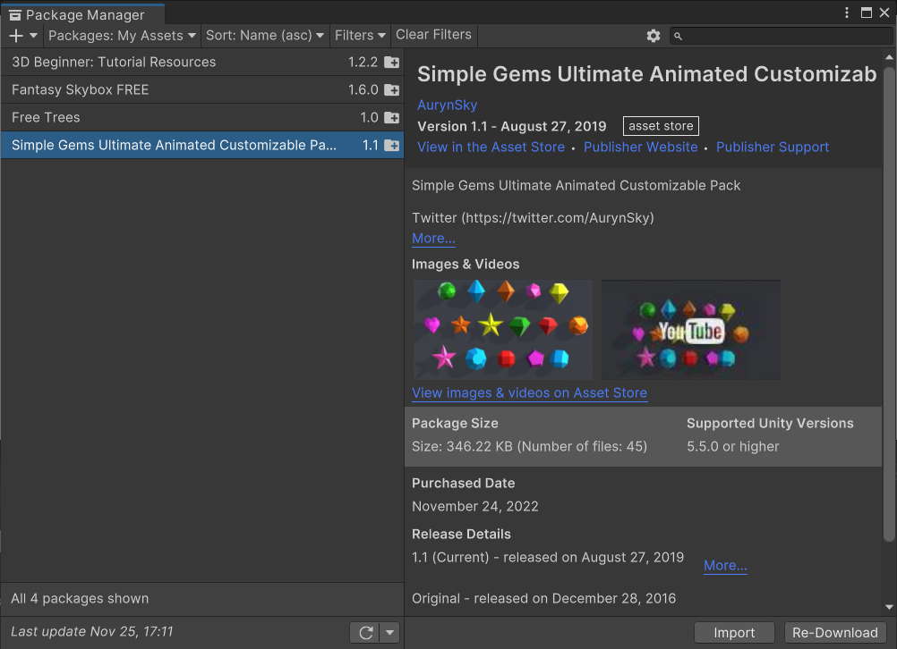

  
  
  

### 结果展示

操作说明：将代码复制到项目中之后，点击**Scenes**，然后点击**Play**，之后就可以点击运行启动游戏

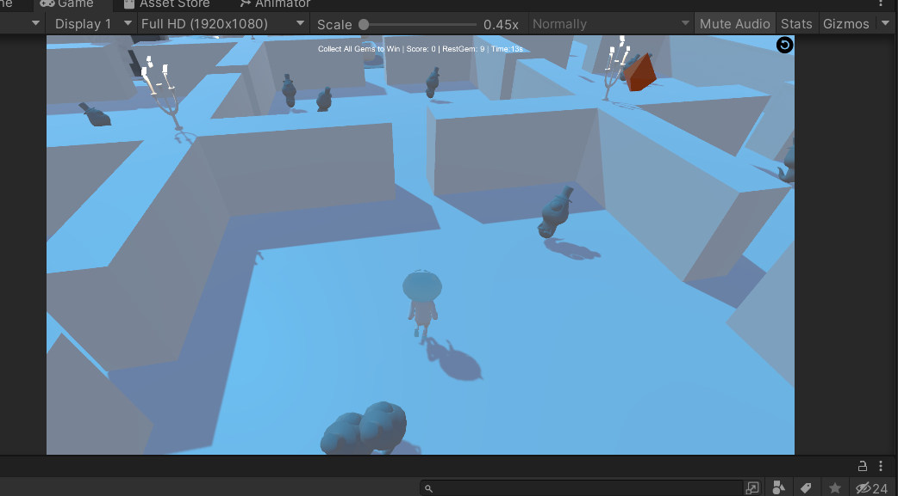


运行过程中，开始界面如下，点击**start**之后，`w`控制小人前进，`Q`,`E`,`A`,`S`,`D`控制小人方向变化。

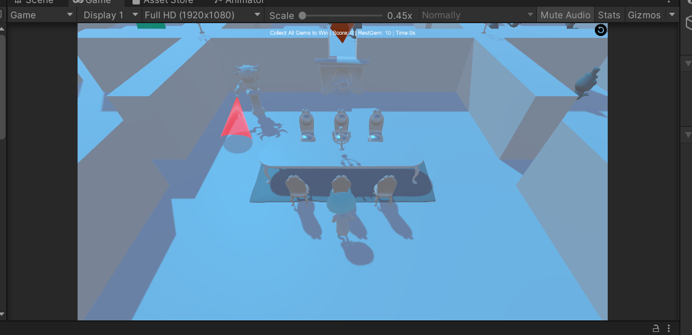


开始游戏后，玩家进入有16个房间的密室，除了玩家开始所在的餐厅之外，每个房间有若干宝石和幽灵，玩家需要集齐所有水晶来打开驱除幽灵，但要小心，不要被幽灵抓到。每摆脱一个幽灵可以获得一分，16个房间中随机散布着10个不同的宝石。如果被幽灵抓住就游戏结束，游戏没有时间限制。如果最终拿到所有的10个宝石，那么玩家胜利

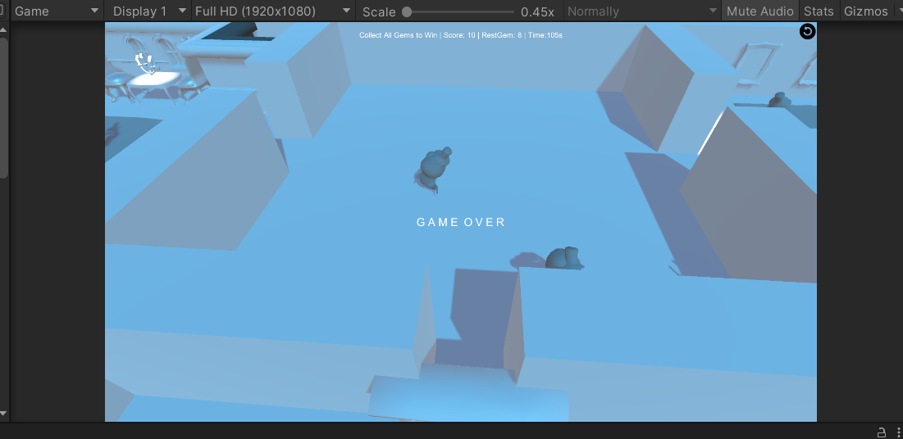


部分过程展示


完整游戏过程请参考文件夹中的**演示视频.mp4**

  

### 关键过程实现

#### 用户交互

主要在`View\UserGUI.cs`中实现，包括三个部分`start`,`win`和`gameover`。

```c#
if(gameover == true) {
    GUI.Button(new Rect(30, 30, Screen.width - 60, Screen.height - 60), "G A M E  O V E R", GameStartStyle);
}
else if(win == true) {
    GUI.Button(new Rect(30, 30, Screen.width - 60, Screen.height - 60), "Y O U  W I N !!!", GameStartStyle);
}
else if(start == false) {
    GUI.Button(new Rect(30, 30, Screen.width - 60, Screen.height - 60), "S T A R T", GameStartStyle);
}
```

  

#### 布局设计

划分了 4X4 个房间，每个房间为正方形，边长为10，不同的房间可能会有一些装饰（也是游戏过程中的障碍物），玩家初始位于的房间是7号，也就是餐厅

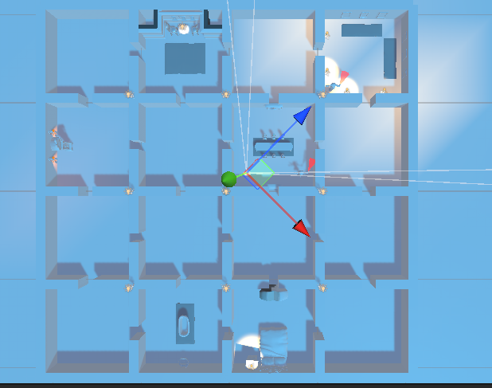


#### Animator

这里使用素材的动画，然后设置Animator

- 幽灵的控制设置

  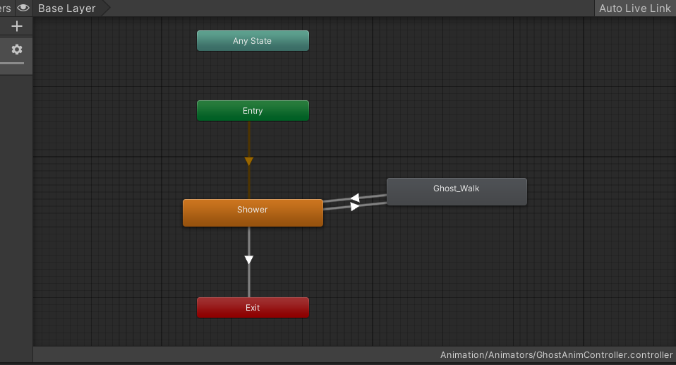

  

- 玩家的控制设置

  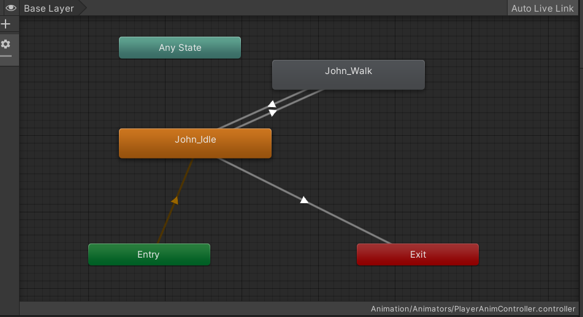

  
  
  

#### Model模块

##### Gam宝石

设置`GemData` 保存宝石的数据

```c#
public int gemID;           // 宝石编号
public int gemRoomID;       // 宝石所在房间号
public bool isValid;        // 宝石是否还存在于地图中
public bool isCatch;        // 玩家是否碰到宝石
```

设置`GemFactory`宝石工厂来管理和生产宝石

- Gems的资源保存在`Resources\myPrbfabs\Gem`中，通过上方的资源下载得到

  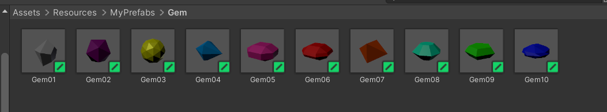

  

- 使用一个list链表来存储已经创建的Gems

  ```c#
  private List<GemData> gems = new List<GemData>();
  ```

- 定义创建，删除宝石和根据房间号来查找宝石的函数方法

  ```c#
  // 返回指定房间内的宝石
  public GameObject GetGem(int roomID){
      if(gems.Count != 0){
          foreach(GemData existGem in gems){
              if(existGem.gemRoomID == roomID){
                  return existGem.gameObject;
              }
          }
      }
      return null;
  }
  
  // 创建指定ID和房间的宝石
  public GameObject GenGem(int gemID, int roomID){
  
      GameObject gem = null;
  
      // 给出宝石的预制路径、根据房间ID算出位置和Quaternion
      string gemPath = gemsPath + gemsID[gemID];
      int x = gemX[(roomID - 1) % 4];
      int z = gemZ[(roomID - 1) / 4];
      Vector3 pos = new Vector3(x, 1, z);
      Quaternion rot = new Quaternion(-0.707106829F, 0, 0, 0.707106829F);
  
      // 创建宝石对象
      gem = GameObject.Instantiate<GameObject>(Resources.Load<GameObject>(gemPath), pos, rot);
  
      // 创建碰撞检测器
      gem.AddComponent<GemCollideSensor>();
  
      // 为创建的宝石对象赋予数据
      gem.AddComponent<GemData>();
      if(gem != null){
          GemData gemData = gem.GetComponent<GemData>();
          gemData.gemID = gemID;
          gemData.gemRoomID = roomID;
          gemData.isValid = true;
          gemData.isCatch = false;
          gems.Add(gemData);
      }
      gem.SetActive(true);
      return gem;
  }
  
  // 删除宝石
  public void FreeGem(GameObject gem){
      foreach(GemData gemData in gems){
          if(gemData.gameObject.GetInstanceID() == gem.GetInstanceID()){
              gem.SetActive(false);
              gems.Remove(gemData);
              break;
          }
      }
  }
  ```

##### Goast幽灵

设置`GoastData`来保存幽灵的数据

```c#
public int ghostRoomID;         // 幽灵所在房间
public int eyeshot;             // 幽灵感知半径
public bool isInRange;          // 是否发现玩家
public bool isFollow;           // 是否正在追击
public bool isCollided;         // 是否抓到玩家
```

设置`GoastFactory`来管理和创建幽灵，实现方式与宝石是一致的

- 幽灵的资源在`Resources\myPrbfabs`中，将Animator的数据设置好

  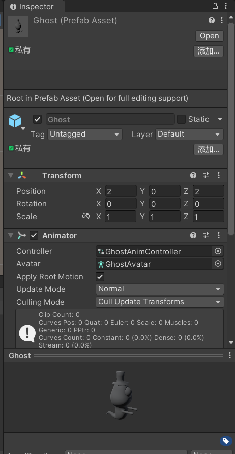

  

- 使用list链表来管理创建好的幽灵

  ```c#
  private List<GhostData> ghostDatas = new List<GhostData>(); 
  ```

- 创建幽灵

  ```c#
  // 创建一个幽灵，i（行）j（列）组成房间号， dx dz 是相对于房间中心的位置
  public GameObject GenGhost(int i, int j, int dx, int dz){
      GameObject ghost = Instantiate(Resources.Load<GameObject>("MyPrefabs/Ghost"));
  
      ghost.transform.position = new Vector3(ghostX[i] + dx, 0, ghostZ[j] + dz);
  
      ghost.AddComponent<GhostData>();
  
      ghost.AddComponent<GhostCollideSensor>();
  
      ghost.transform.GetChild(0).gameObject.AddComponent<InRangeSensor>();
      ghost.transform.GetChild(0).gameObject.GetComponent<InRangeSensor>().ghost = ghost;
  
      GhostData ghostData = ghost.GetComponent<GhostData>();
      ghostData.ghostRoomID = i + j * 4 + 1;
      // 感知半径为5
      ghostData.eyeshot = 5;
      ghostData.isInRange = false;
      ghostData.isFollow = false;
      ghostData.isCollided = false;
  
      ghostDatas.Add(ghostData);
  
      return ghost;
  }
  ```


##### player玩家

设置`PlayerData`来管理玩家数据

```c#
public int playerRoomID;     // 玩家所在房间
public bool alive;           // 玩家是否存活
```

设置`PlayerFactory`来管理和创建玩家数据

- Player只有一个，资源存储在`Resources\MyFrbfabs`中,设置好Animator

  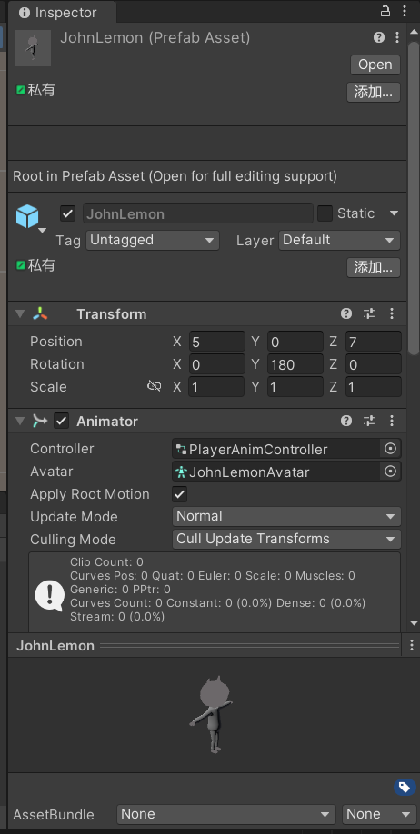

  

- 因为玩家只有一个，因此只需要创建一个即可

  ```c#
  public GameObject GenPlayer(){
  
      GameObject player = Instantiate(Resources.Load<GameObject>("MyPrefabs/JohnLemon"));
  
      player.AddComponent<PlayerController>();
      player.AddComponent<PlayerData>();
      playerData = player.GetComponent<PlayerData>();
  
  
      // 开始房间：7
      playerData.playerRoomID = 7;
      playerData.alive = true;
  
      return player;
  }
  ```


#### Controller模块

是各类控制器

##### CameraController

让摄像机随着玩家移动而移动

```c#
public class CameraController : MonoBehaviour
{
	public GameObject player;
    public float distanceAway = 3F;		 	// 摄像头离玩家的水平距离	
	public float distanceUp = 3F;			// 摄像头离地面的垂直距离		
	public float smooth = 2F;				// 平滑变换参数
		
	private Vector3 m_TargetPosition;		// 摄像头的位置
	
	Transform follow;        				// 摄像头望向的位置
	
	void Start(){
		
	}
	
	void LateUpdate ()
	{
		follow = player.transform.GetChild(2);
		
		// 设置摄像头的目标位置
		m_TargetPosition = follow.position + Vector3.up * distanceUp - follow.forward * distanceAway;
		
		// 对移动过程进行平滑变换
		transform.position = Vector3.Lerp(transform.position, m_TargetPosition, Time.deltaTime * smooth);
		
		// 望向指定位置
		transform.LookAt(follow);
	}
}
```

注意这个摄像机需要手动挂载到**main camera**上

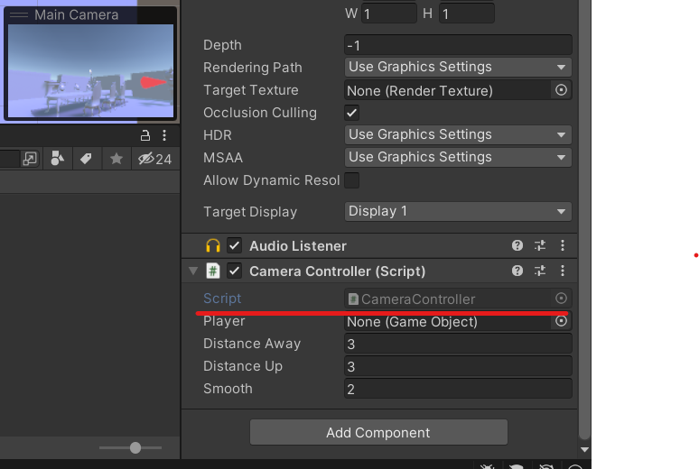


##### FirstController

这个需要挂载到一个空对象中

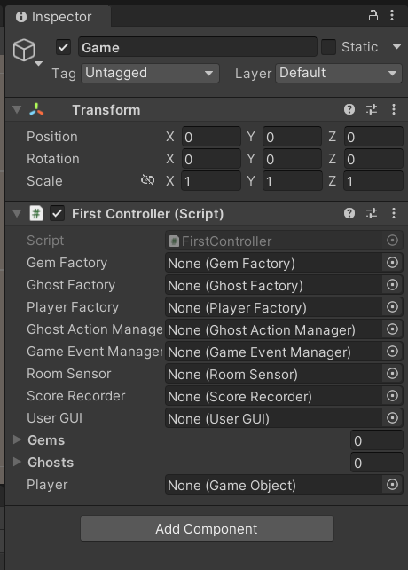


- 随机放置宝石和幽灵

  ```c#
  // 在地图中随机生成十个宝石，随机分布在16个房间中
  public List<GameObject> generateRandomGems(){
      List<GameObject> gems = new List<GameObject>();
  
      int[] validRoom = new int[13] {1,2,3,4,5,6,8,9,10,11,12,13,16};
      int[] gemRoom = new int[10];
      int[] notChoose = new int[3];
  
      // 一共要生成10个宝石，设定上有13个房间（validRoom）可以放宝石
      // 随机选取其中3个房间（notChoose）不放宝石，剩下的10个房间（gemRoom）放宝石
      notChoose[0] = Random.Range(0, validRoom.Length);
      do{
          notChoose[1] = Random.Range(0, validRoom.Length);
      }while (notChoose[0] == notChoose[1]);
      do{
          notChoose[2] = Random.Range(0, validRoom.Length);
      }while (notChoose[0] == notChoose[2] || notChoose[1] == notChoose[2]);
  
      int j = 0;
      for(int i = 0; i < validRoom.Length; i++){
          if(i != notChoose[0] && i != notChoose[1] && i != notChoose[2]){
              int t = validRoom[i];
              gemRoom[j] = t;
              j++;
          }
      }
  
      // 调用宝石工厂创建10个宝石
      for(int i = 0; i < 10; i++){
          GameObject gem = gemFactory.GenGem(i + 1, gemRoom[i]);
          gems.Add(gem);
      }
  
      return gems;
  }
  
  // 在地图中生成若干幽灵，幽灵的个数和位置可以在此函数调整
  public List<GameObject> generateRandomGhosts(){
  
      List<GameObject> ghosts = new List<GameObject>();
  
      for (int i = 0; i < 4; i++) {
          for (int j = 0; j < 4; j++) {
              if(i == 2 && j == 1){
                  // 起始房间：不生成灵魂
              }
              else if(i == 0 && j == 1){
                  // 邪恶房间：5只幽灵
                  GameObject ghost = ghostFactory.GenGhost(i, j, 2, 2);
                  ghosts.Add(ghost);
  
                  GameObject ghost2 = ghostFactory.GenGhost(i, j, -3, -2);
                  ghosts.Add(ghost2);
  
                  GameObject ghost3 = ghostFactory.GenGhost(i, j, 1, -3);
                  ghosts.Add(ghost3);
  
                  GameObject ghost4 = ghostFactory.GenGhost(i, j, -1, 2);
                  ghosts.Add(ghost4);
  
                  GameObject ghost5 = ghostFactory.GenGhost(i, j, -2, 1);
                  ghosts.Add(ghost5);
              }
              else{
                  // 普通房间：3只幽灵
                  GameObject ghost = ghostFactory.GenGhost(i, j, 2, 2);
                  ghosts.Add(ghost);
  
                  GameObject ghost2 = ghostFactory.GenGhost(i, j, -3, -2);
                  ghosts.Add(ghost2);
  
                  GameObject ghost3 = ghostFactory.GenGhost(i, j, 1, -3);
                  ghosts.Add(ghost3);
              }
          }
      }
      return ghosts;
  }
  // 载入资源：生成玩家、幽灵和宝石
  public void LoadResources(){
      Debug.Log("Load Resource...");
  
      gems = generateRandomGems();
      ghosts = generateRandomGhosts();
      player = playerFactory.GenPlayer();
  }
  ```

- 玩家、幽灵和宝石的设置

  ```c#
  // 每甩开一个幽灵，玩家得 1 分
  public void OnGoalLost(GameObject ghost) {
      ghostActionManager.Walk(player, ghost);
      if(player.GetComponent<PlayerData>().alive){
          scoreRecorder.Record(1);
      }
  }
  
  // 玩家进入幽灵的视野，幽灵开始追击
  public void OnFollowing(GameObject ghost) {
      if(player.GetComponent<PlayerData>().alive) {
          ghostActionManager.Follow(player, ghost);
          Debug.Log("I See U!");
      }
  }
  
  // 玩家获取水晶，当获得全部水晶，游戏获胜
  public void OnGettingGem(GameObject gem) {
      gem.SetActive(false);
      restGemNum--;
      if(restGemNum == 0) {
          Win();
      }
  }
  
  // 失败
  public void GameOver() {
      Debug.Log("GameOver");
      player.GetComponent<PlayerData>().alive = false;
      player.SetActive(false);
      userGUI.gameover = true;
  }
  
  // 胜利，幽灵消失，你可以在房间里闲逛
  public void Win() {
      Debug.Log("YouWin");
      for(int i = 0; i < ghosts.Count; i++){
          ghosts[i].SetActive(false);
      }
      userGUI.win = true;
  }
  ```

##### GameEventManager

时间管理器

```c#
public class GameEventManager : MonoBehaviour
{
    // 玩家逃脱事件
    public delegate void EscapeEvent(GameObject ghost);
    public static event EscapeEvent OnGoalLost;
    // 巡逻兵追击事件
    public delegate void FollowEvent(GameObject ghost);
    public static event FollowEvent OnFollowing;
    // 游戏失败事件
    public delegate void GameOverEvent();
    public static event GameOverEvent GameOver;
    // 游戏胜利事件
    public delegate void WinEvent();
    public static event WinEvent Win;

    // 获取宝石事件
    public delegate void GemEvent(GameObject gem);
    public static event GemEvent OnGettingGem;

    // 玩家逃脱
    public void PlayerEscape(GameObject ghost) {
        if (OnGoalLost != null) {
            OnGoalLost(ghost);
        }
    }

    // 获得水晶
    public void GettingGem(GameObject gem) {
        if(OnGettingGem != null){
            OnGettingGem(gem);
        }
    }

    // 幽灵追击
    public void FollowPlayer(GameObject ghost) {
        if (OnFollowing != null) {
            OnFollowing(ghost);
        }
    }

    // 玩家被抓
    public void OnPlayerCatched() {
        if (GameOver != null) {
            GameOver();
        }
    }

}
```

##### ISceneController

```c#
public interface ISceneController
{
    void LoadResources();
}
```

##### PlayerController

玩家操作控制，主要是键盘的操作控制玩家的转向和前进

```c#
// W键前进，Q E A D S 转向，空格键停下
void Update()
{
    if(Input.GetKeyDown("w")){
        ani.SetBool("WalkBool", true);
    }
    else if(Input.GetKeyDown("q")){
        transform.Rotate(0, -45F, 0);
    }
    else if(Input.GetKeyDown("e")){
        transform.Rotate(0, 45F, 0);
    }
    else if(Input.GetKeyDown("a")){
        transform.Rotate(0, -90F, 0);
    }
    else if(Input.GetKeyDown("s")){
        transform.Rotate(0, 180F, 0);
    }
    else if(Input.GetKeyDown("d")){
        transform.Rotate(0, 90F, 0);
    }

    if(Input.GetKey(KeyCode.Space)){
        ani.SetBool("WalkBool", false);
    }
}
```

##### ScoreRecorder

分数管理器，每次调用一次记录就加一

```c#
// 计分器：每幽摆脱一个幽灵的追击，获得 1 分
public class ScoreRecorder : MonoBehaviour
{
    public int score;

    void Start() {
        score = 0;
    }

    public void Record(int i) {
        score += i;
    }

    public void Reset() {
        score = 0;
    }
}
```


#### Action模块

##### GhostWalkAction

幽灵行走的action

- 设置幽灵的尾随，当幽灵发现玩家就进行尾随的动作，切换到追击模式

  ```c#
  public override void Update() {
  
      if (!gData.isFollow && gData.isInRange && gData.ghostRoomID == pData.playerRoomID && !gData.isCollided && pData.alive == true) {
          // 尾随
          this.destroy = true;
          this.enable = false;
          this.callback.SSActionEvent(this);
          this.gameObject.GetComponent<GhostData>().isFollow = true;
          Singleton<GameEventManager>.Instance.FollowPlayer(this.gameObject);
      }
      else {
          // 闲逛
          Walking();
      }
  }
  ```

- 当幽灵没有发现玩家，就进行闲逛

  ```c#
  void Walking() {
  
      // 随机转向
      if (turn) {
          GhostX = this.transform.position.x + Random.Range(-3F, 3F);
          GhostZ = this.transform.position.z + Random.Range(-3F, 3F);
          this.transform.LookAt(new Vector3(GhostX, 0, GhostZ));
          this.gameObject.GetComponent<GhostData>().isCollided = false;
          turn = false;
      }
  
      float distance = Vector3.Distance(transform.position, new Vector3(GhostX, 0, GhostZ));
  
      if (this.gameObject.GetComponent<GhostData>().isCollided) {
  
          // 碰墙时逆时针旋转120~180度
          this.transform.Rotate(Vector3.up, Random.Range(120, 180));
          GameObject temp = new GameObject();
          temp.transform.position = this.transform.position;
          temp.transform.rotation = this.transform.rotation;
          temp.transform.Translate(0, 0, Random.Range(0.5F, 2F));
          GhostX = temp.transform.position.x;
          GhostZ = temp.transform.position.z;
          this.transform.LookAt(new Vector3(GhostX, 0, GhostZ));
          Destroy(temp);
          this.gameObject.GetComponent<GhostData>().isCollided = false;
  
      } else if (distance <= 0.1F) {
          turn = true;
      } else {
          // 直行
          this.transform.Translate(0, 0, speed * Time.deltaTime);
      }
  }
  ```


##### GhostFollowAction

注意在追击过程中如果被玩家甩开了就切换到闲逛模式，否则就一直跟随玩家

```c#
public override void Update() {

    if (gData.isFollow && (!gData.isInRange || gData.ghostRoomID != pData.playerRoomID || gData.isCollided || pData.alive == false)) {
        // 放弃跟随
        this.destroy = true;
        this.enable = false;
        this.callback.SSActionEvent(this);
        this.gameObject.GetComponent<GhostData>().isFollow = false;
        Singleton<GameEventManager>.Instance.PlayerEscape(this.gameObject);
    }
    else {
        // 尾随
        Following();
    }
}

void Following() {
    // 面向玩家
    transform.LookAt(player.transform.position);
    // 跟随玩家
    transform.position = Vector3.MoveTowards(this.transform.position, player.transform.position, speed * Time.deltaTime);
}
```


##### GhostActionManager

管理幽灵的闲逛、追击和停止的动作，分别调用相应的动作

```c#
// 闲逛
public void Walk(GameObject player, GameObject ghost) {
    this.walk = GhostWalkAction.GetAction(player, ghost);
    this.RunSSAction(ghost, walk, this);
}

// 追击
public void Follow(GameObject player, GameObject ghost) {
    this.follow = GhostFollowAction.GetAction(player, ghost);
    this.RunSSAction(ghost, follow, this);
}

// 停止
public void DestroyAllActions() {
    DestroyAll();
}
```


#### Sensor模块

用于处理不同对象的碰撞和接触

##### GemCollideSensor

宝石碰撞检测器，被挂载在宝石上，用于检测玩家是否接触到宝石

```c#
void OnTriggerEnter(Collider collider) {
    sceneController = SSDirector.GetInstance().CurrentSceneController as FirstController;
    if (collider.gameObject.Equals(sceneController.player)) {
        // 玩家获取宝石
        Singleton<GameEventManager>.Instance.GettingGem(this.gameObject);
    }
}
```

##### GhostCollideSensor

幽灵碰撞检测器，用于检测幽灵是否抓到玩家

```c#
void OnTriggerEnter(Collider collider) {
    sceneController = SSDirector.GetInstance().CurrentSceneController as FirstController;
    if (collider.gameObject.Equals(sceneController.player)) {
        // 幽灵抓到玩家
        Debug.Log("Ghost: Catch U!");
        Singleton<GameEventManager>.Instance.OnPlayerCatched();
    }
    else {
        // 幽灵碰到障碍物
        Debug.Log("Ghost: Oops!");
        this.GetComponent<GhostData>().isCollided = true;
    }
}
```

##### InRangeSensor

幽灵范围感知器：挂载在幽灵的第一个子对象上（一个可穿透的半径为 5 的不可见球）

```c#
void OnTriggerEnter(Collider collider) {
    sceneController = SSDirector.GetInstance().CurrentSceneController as FirstController;
    if (collider.gameObject.Equals(sceneController.player)) {
        ghost.GetComponent<GhostData>().isInRange = true;
    }
}
void OnTriggerExit(Collider collider) {
    sceneController = SSDirector.GetInstance().CurrentSceneController as FirstController;
    if (collider.gameObject.Equals(sceneController.player)) {
        // 玩家离开幽灵视线
        ghost.GetComponent<GhostData>().isInRange = false;
    }
}
```

##### RoomSensor

```c#
void Update() {
    sceneController = SSDirector.GetInstance().CurrentSceneController as FirstController;

    // 更新玩家所在的房间号
    PlayerUpdate();

    tri++;
    // 降低幽灵的检查频率，避免反复转弯
    if(tri == 20){
        GhostCheck();
        tri = 0;
    }

}

void PlayerUpdate() {
    GameObject player = sceneController.player;
    Vector3 position = player.transform.position;
    float x = position.x;
    float z = position.z;
    int row = (int) ((x + 20) / 10 + 1);
    int col = (int) (4 - (z + 20) / 10);
    player.GetComponent<PlayerData>().playerRoomID = row + col * 4;
}

void GhostCheck() {
    for(int i = 0 ; i < sceneController.ghosts.Count ; i++) {
        GameObject ghost = sceneController.ghosts[i];
        Vector3 gPosition = ghost.transform.position;

        // 幽灵的位置
        float gX = gPosition.x;
        float gZ = gPosition.z;

        // 房间对应的行数和列数
        int gRoomID = ghost.GetComponent<GhostData>().ghostRoomID;
        int gRow = (gRoomID - 1) / 4;
        int gCol = (gRoomID - 1) % 4;

        // 房间中心的位置
        float cX = ghostX[gCol];
        float cZ = ghostZ[gRow];

        if(gX < cX - range || gX > cX + range || gZ < cZ - range || gZ > cZ + range){
            // 如果幽灵尝试离开房间，则视为发生碰撞
            ghost.GetComponent<GhostData>().isCollided = true;
        }
    }
}
```

