# 作业7——简单粒子系统

## 马宛宜 20337092 软件工程

### 作业要求

简单粒子制作

- 按参考资源要求，制作一个粒子系统

### 实现结果

火焰粒子系统的实现

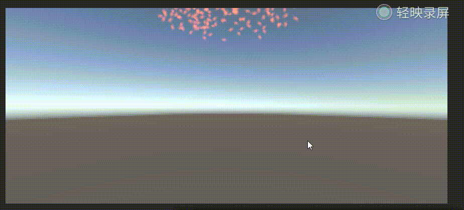

### 实现过程

- 首先准备好一个火焰的素材图片，这里在CSDN上找到了一张图片

  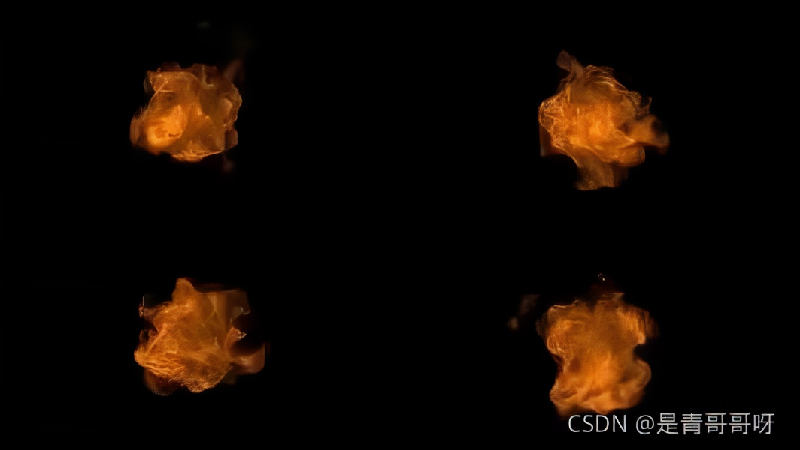

- 点击Effect->Particle System创建一个Effects对象，命名为**fire**

  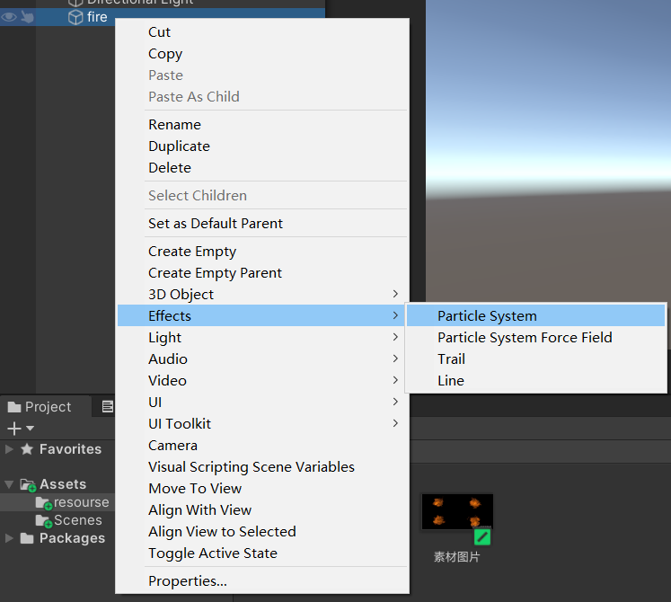

- 在资源面板中创建一个matrices，命名为fire，注意要将shader改为`Mobile/Particles/Additive`，这个模式主要是可以去除透亮贴图中的黑色部分。将素材图片也放入资源文件夹中，并将将贴图赋给材质

  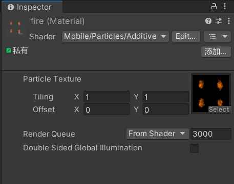

- 将材质赋给之前创建的effects对象fire，此时可以看到粒子就变为贴图的火苗了

  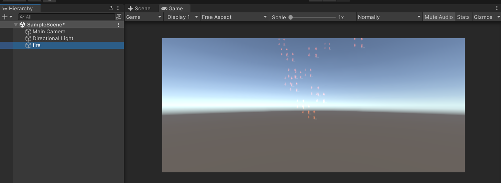

- 修改effects的属性，让火焰更逼真

  - 将`Texture Sheet Animation`纹理层动画模块勾选上，并将`Tiles`更改为2，表示贴图的行列为2

  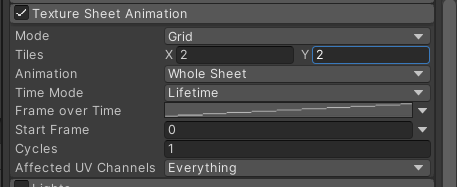

  - 更改`Renderer`的`Max Particle Size`最大粒子大小，改为1

    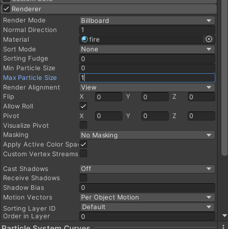

  - 更改初始旋转角度Start Rotation，选择Random Between Two Constants
    
    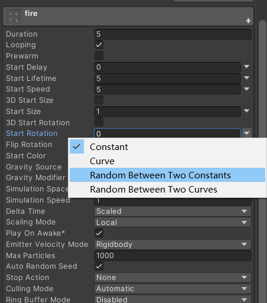
    
  - 设置角度为(-360, 360)
  
    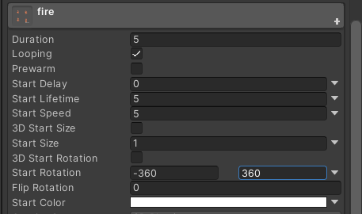
  
  - 更改发射器Emission模块中的数值，使火焰更加逼真。
  
    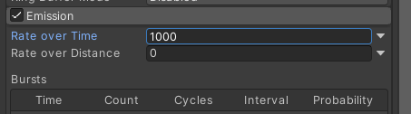
  
  - 更改粒子的形状，这里我更改了角度，设置为30
  
    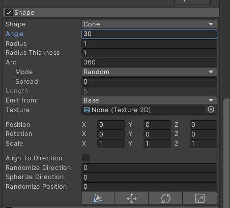
    
  - 对火焰颜色进行调整，用到Color over Lifetime
  
    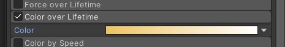
  
  - 更改初始的周期和速度
  
    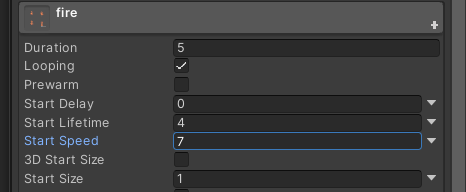
  
- 最终实现效果为

  

  