# 作业8——简易血条制作

## 马宛宜 20337092 软件工程

### 作业要求

血条（Health Bar）的预制设计。具体要求如下

- 使用 IMGUI 和 UGUI 实现
- 使用 UGUI，血条是游戏对象的一个子元素，任何时候需要面对主摄像机
- 分析两种实现的优缺点
- 给出预制的使用方法


### 使用方法

将代码的`Assets`放入到代码中，其中只要将`Cube`下面的`Canvas`禁用（也就是在Canvas的选择框不勾选），此时运行的就是`IMGUI`的代码和结果，将`Canvas`勾选上就是运行`UGUI`的代码和结果


### 具体实现

#### 平台的搭建

创建一个`Plane`和`Cube`的对象，构建一个基础框架

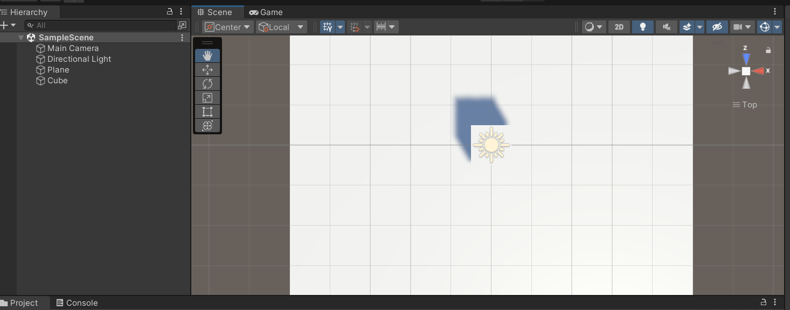

cube移动动画的设置

创建一个Animator controller名为`Cube`，再创建一个Animator名为`CubeMove`，动画设置如下所示，再将Animator controller挂载到Cube下

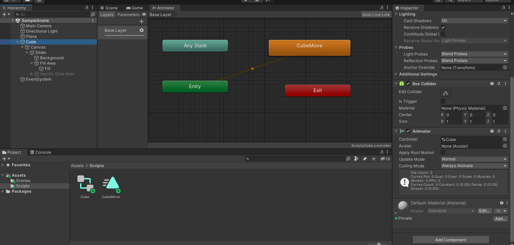

以上平台就搭建好了

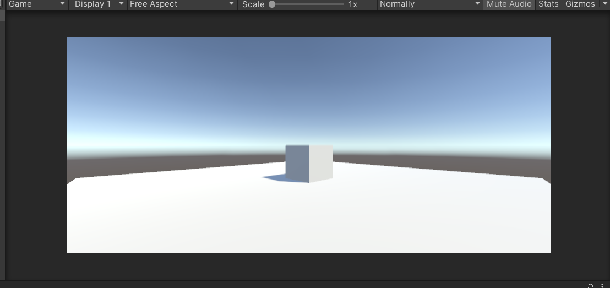


#### IMGUI的实现

##### 结果展示

> 键盘`a`表示攻击，血量下降；`h`表示治愈，血量上升；`r`表示重启，血量变为初始值

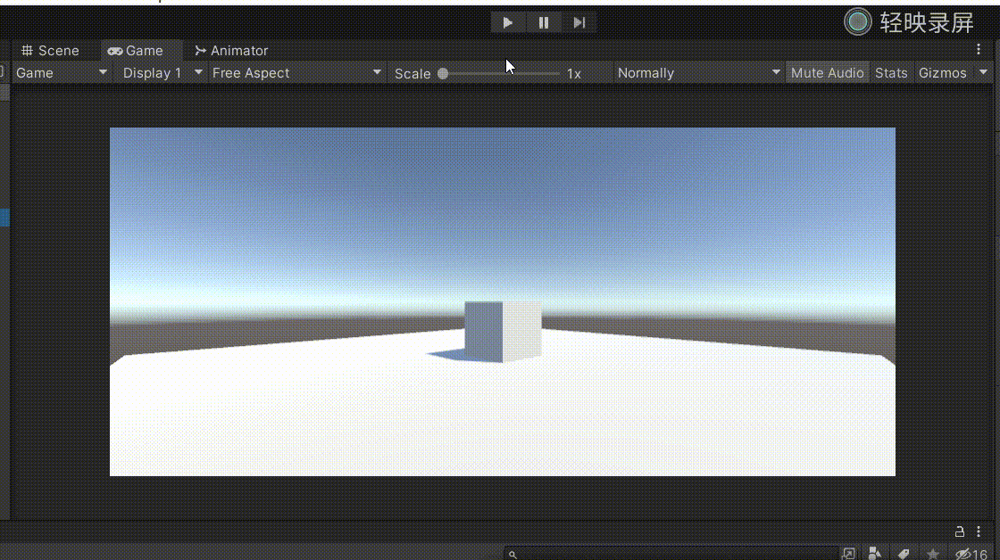

##### 代码

场景控制器`FirstController`，使用键盘来控制血条，其中`a`表示攻击，血量减少；`h`表示治愈，血量增加；`r`表示重启，血量回到初始值

```c#
using System.Collections;
using System.Collections.Generic;
using UnityEngine;

public class FirstController : MonoBehaviour, IUserAction
{
    public HealthBar healthBar;
    public HealthBar2 healthBar2;

    public float hurt = 250F;
    public float heal = 1000F;

    void Start() {
        gameObject.AddComponent<HealthBar>();
        healthBar = Singleton<HealthBar>.Instance;
    }

    void Update() {

        if(Input.GetKeyDown("a")){
            Hurt();
        }

        if(Input.GetKeyDown("h")){
            Heal();
        }

        if(Input.GetKeyDown("r")){
            Restart();
        }

    }

    public void Hurt() {
        healthBar.Hurt(hurt);
        healthBar2.Hurt(hurt);
    }

    public void Heal() {
        healthBar.Heal(heal);
        healthBar2.Heal(heal);
    }

    public void Restart() {
        healthBar.restart = true;
        healthBar2.restart = true;
    }
}
```

`IUserAction`

```c#
using System.Collections;
using System.Collections.Generic;
using UnityEngine;

public interface IUserAction {
    void Restart();
    void Hurt();
    void Heal();
}
```

`Singleton`

```c#
using System.Collections;
using System.Collections.Generic;
using UnityEngine;

public class Singleton<T> : MonoBehaviour where T : MonoBehaviour
{
	protected static T instance;

	public static T Instance {  
		get {  
			if (instance == null) { 
				instance = (T)FindObjectOfType (typeof(T));  
				if (instance == null) {  
					Debug.LogError ("An instance of " + typeof(T) + " is needed in the scene, but there is none.");  
				}  
			}  
			return instance;  
		}  
	}
}
```

`HealthBar`（核心代码）

```c#
using System.Collections;
using System.Collections.Generic;
using UnityEngine;

public class HealthBar : MonoBehaviour
{

    public float healthUpperLimit;  // 生命值上限
    private float healthValue;		// 当前的生命值

    public bool restart;			// 按R键让血量恢复原状

    void Start() {
        healthUpperLimit = 5000.0F;
        healthValue = healthUpperLimit;
        restart = false;
    }

    void Update() {
        if(restart){	// 恢复原状
            healthUpperLimit = 5000.0F;
            healthValue = healthUpperLimit;
            restart = false;
        }
    }

    public void Hurt(float h) { // 造成 h 点伤害
        healthValue -= h;
        if(healthValue <= 0){
            healthValue = 0;
        }
    }

    public void Heal(float h) { // 治疗 h 点
        if(healthValue > 0){
            healthValue += h;
            if(healthValue >= healthUpperLimit) {
                healthValue = healthUpperLimit;
            }
        }
    }

    void OnGUI() {

        GUIStyle healthTextStyle = new GUIStyle();
        healthTextStyle.fontSize = 20;
        healthTextStyle.alignment = TextAnchor.MiddleCenter;
        
        if(healthValue < healthUpperLimit * 0.3) {
            GUI.color = Color.red;		// 当血量少于上限的30%时，血条为红色
        }
        else if(healthValue < healthUpperLimit * 0.6) {
            GUI.color = Color.yellow;	// 当血量少于上限的60%时，血条为黄色
        }
        else {
            GUI.color = Color.green;	// “健康状况下”，血条为绿色
        }
        
        // 用横向滚动条实现血条
        GUI.HorizontalScrollbar(new Rect(30, 30, Screen.width - 60, 30), 0.0F, healthValue, 0.0F, healthUpperLimit);
        // 显示当前血量
        GUI.Label(new Rect(30, 50, Screen.width - 60, 20), healthValue.ToString() + " / " + healthUpperLimit.ToString(), healthTextStyle);
        
    }
}
```

##### 配置方法

创建一个空对象`FirstController`，把`FirstController`脚本文件挂载到该空对象上，让程序可以使用键盘来控制血条的变化，然后点击运行即可

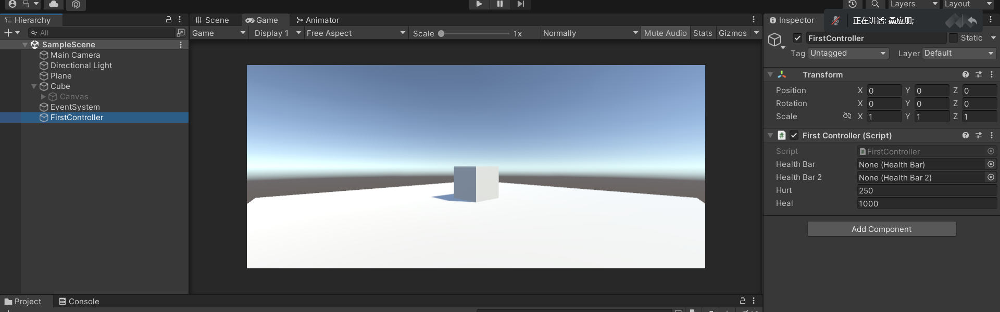


#### UGUI的实现

##### 结果展示

> 键盘`a`表示攻击，血量下降；`h`表示治愈，血量上升；`r`表示重启，血量变为初始值

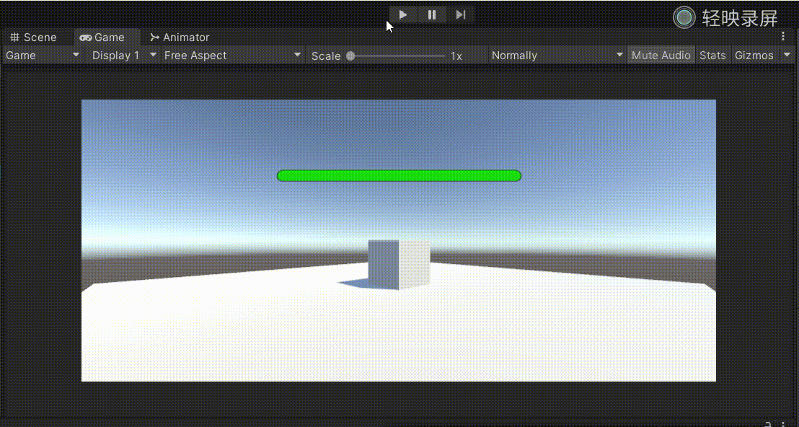

##### 代码

其他的组件代码与IMGUI一致

`HealthBar2`

```c#
using System.Collections;
using System.Collections.Generic;
using UnityEngine;
using UnityEngine.UI;

public class HealthBar2 : MonoBehaviour
{
    public Slider slider;

    public bool restart;

    void Start() {
        slider.maxValue = 5000.0F;
        slider.minValue = 0F;
        slider.value = slider.maxValue;
        restart = false;
    }

    void Update() {

        // 面向摄像机，此时血条会发生抖动
        // slider.direction = Slider.Direction.RightToLeft;
        // slider.transform.LookAt(Camera.main.transform.position);

        // 不是面向摄像机，而是面向游戏屏幕
        slider.direction = Slider.Direction.LeftToRight;
        slider.transform.rotation = Camera.main.transform.rotation;
        

        if(restart){
            slider.maxValue = 5000.0F;
            slider.value = slider.maxValue;
            restart = false;
        }

        if(slider.value <= 0.3 * slider.maxValue){
            slider.fillRect.transform.GetComponent<Image>().color = Color.red;
        }
        else if(slider.value <= 0.6 * slider.maxValue){
            slider.fillRect.transform.GetComponent<Image>().color = Color.yellow;
        }
        else{
            slider.fillRect.transform.GetComponent<Image>().color = Color.green;
        }
    }

    public void Hurt(float h) {
        slider.value -= h;
        if(slider.value <= 0){
            slider.value = 0;
        }
    }

    public void Heal(float h) {
        if(slider.value > 0){
            slider.value += h;
            if(slider.value >= slider.maxValue) {
                slider.value = slider.maxValue;
            }
        }
    }
}
```

##### 镜头跟随设计

如果血条在设计时设置面向摄像机，此时血条会发生抖动

```c#
slider.direction = Slider.Direction.RightToLeft;
slider.transform.LookAt(Camera.main.transform.position);
```

正确来说应该设计面向游戏屏幕，此时血条才不会发生抖动。此时如果下面设置血条 rotaion 与摄像机 rotation 一致，血条会翻转，我们看到的是血条的背面，所以血条变化应该自左向右。

```c#
slider.direction = Slider.Direction.LeftToRight;
slider.transform.rotation = Camera.main.transform.rotation;
```

**对比演示**

| 面向摄像头                          | 面向屏幕                          |
| ----------------------------------- | --------------------------------- |
| 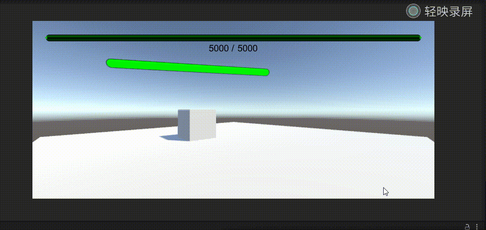 | 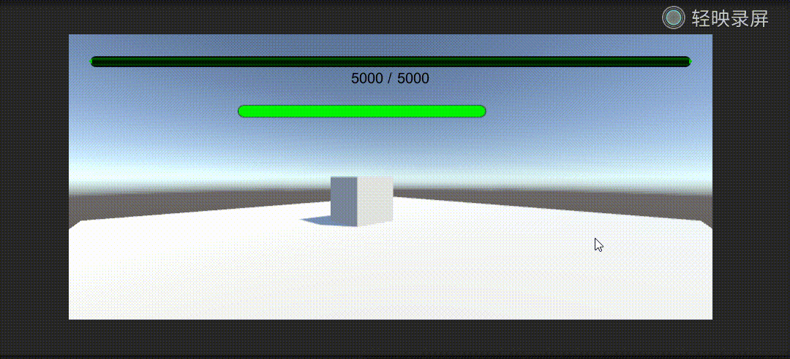 |


##### 配置过程

在cube下创建`Canvas`和`Slider`对象，这两个都是在UI之下的

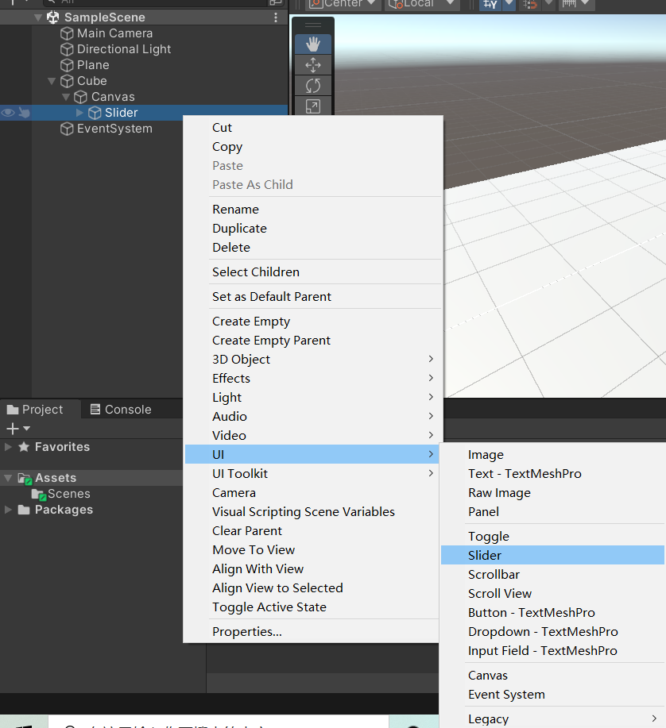

设置`Canvas`的参数，注意这里的Render Model需要设置为`World Space`，相机要设置为`Main Camera`

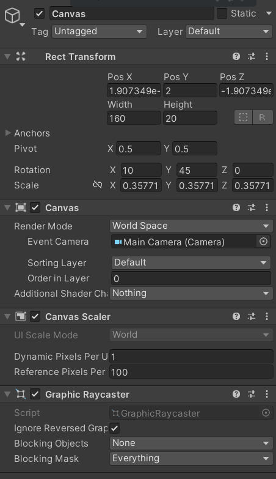

设置`Slider`的参数，注意最大值的设置，这里设置最大值为5000


此时的图像为，可以看出此时是有圆形的滑块的


下面对于`Slider`进行调整

- 对于`Fill Area`进行参数调整

  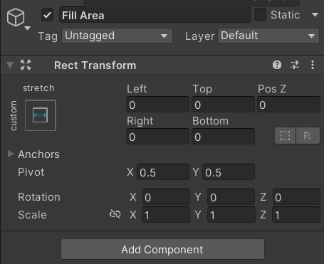

- 对于`Fill`进行参数调整，设置血条的颜色为绿色

  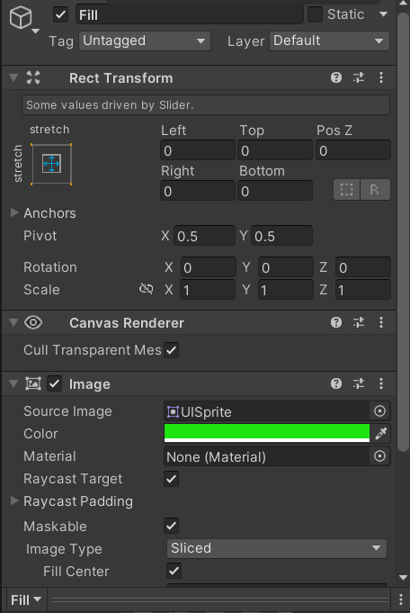

- 关闭圆形滑块，在勾选的框中选择不勾选

  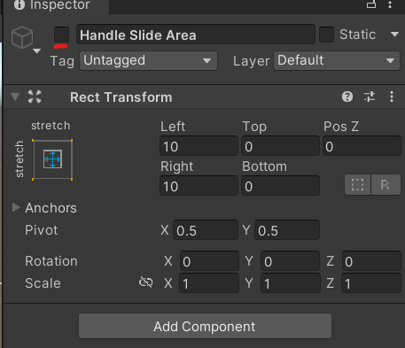

- 最终结果:

  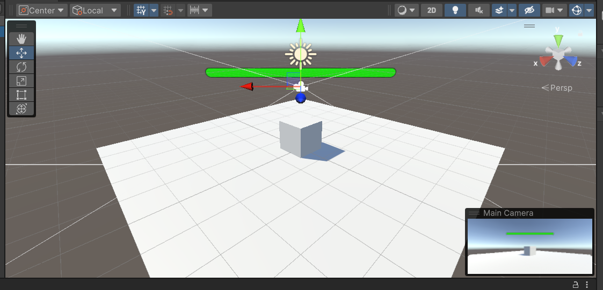

将`Health Bar2`脚本代码挂载到`Canvas`上，并将Slider设置为上面设置好的`Slider`

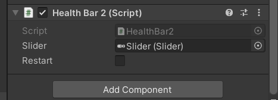

如IMGUI的`FirstController`一样，在该对象上将`Health Bar2`的对象设置为`Canvas`

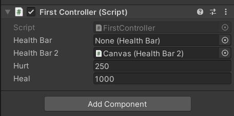

配置完成，点击运行即可


#### 优缺点分析

**IMGUI**

- 优点：便于实现，代码简单，容易上手
- 缺点
  - 每一帧都需要重算布局重新渲染UI组件，性能较低。
  - 不能自主设计血条样式，布局麻烦，实用性较低

**UGUI**

- 优点：性能高，有交互界面可以设计血条，可以设计风格各异的组件。
- 缺点：实现较为复杂